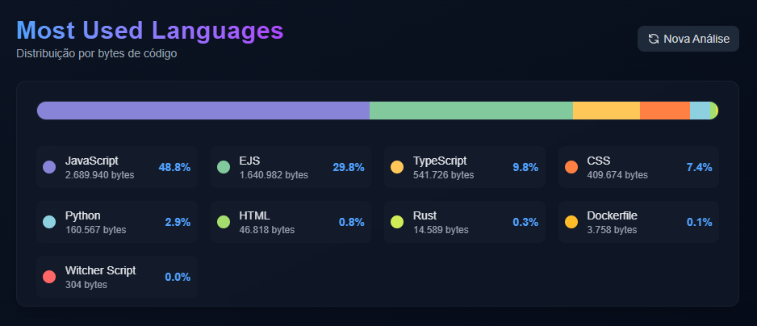
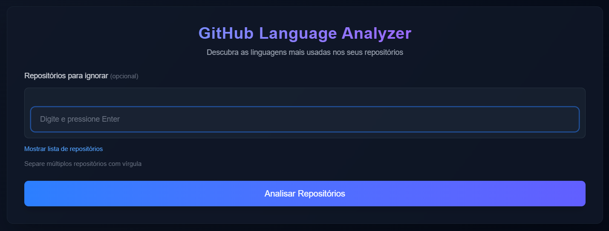
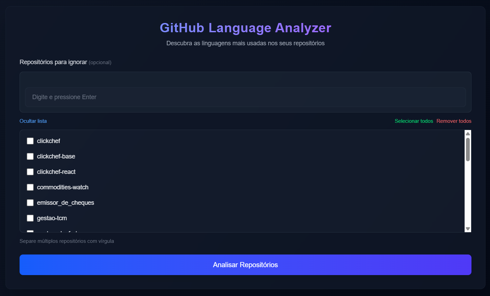
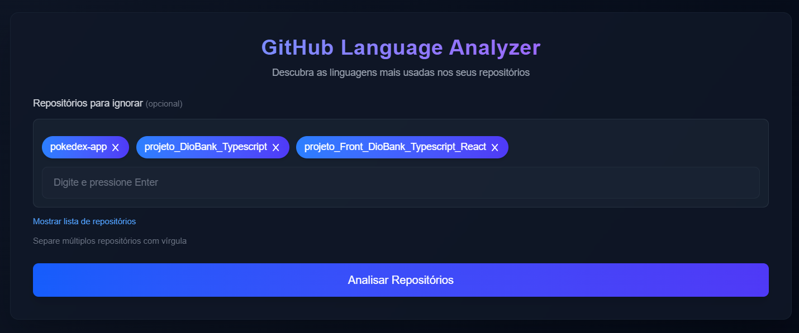

# GitHub Language Stats




> Visualizador de estatísticas de linguagem dos seus repositórios GitHub. A aplicação analisa todos seus projetos e exibe um gráfico interativo mostrando a distribuição das linguagens de programação utilizadas.

### Ajustes e melhorias

O projeto ainda está em desenvolvimento e as próximas atualizações serão voltadas para updates.

## 💻 Pré-requisitos

Antes de começar, verifique se você atendeu aos seguintes requisitos:

- Você instalou a versão mais recente do `Node.js (v16+)`
- Você tem uma máquina `Windows / Linux / Mac`. 
- Você tem um token de acesso pessoal do GitHub (para repositórios privados)

## 🚀 Instalando GitHub Language Stats

Para instalar o GitHub Language Stats, siga estas etapas:

Linux e Windows:
```
git clone https://github.com/alxndd-s/github-stats
cd github-stats
npm install
```

## ☕ Usando GitHub Language Stats

Para usar GitHub Language Stats, siga estas etapas:

1. Gere seu token em https://github.com/settings/tokens, o token deve ser do tipo classic e conter as permissoes de leitura.

2. Crie um arquivo .env na raiz do projeto com a chave TOKEN = 'ghp_pa4568d4sa.......'

3. Inicie o servidor de desenvolvimento com :

```
npm run dev
```

3. Acesse `http://localhost:3000` no navegador

4. Na tela inicial após carregar todos os seus repositórios, poderá incluir repositórios para ignorar, digitando, ou escolhendo da lista !








## 📝 Licença

Esse projeto está sob licença MIT. Veja o arquivo [LICENÇA](LICENSE.md) para mais detalhes.